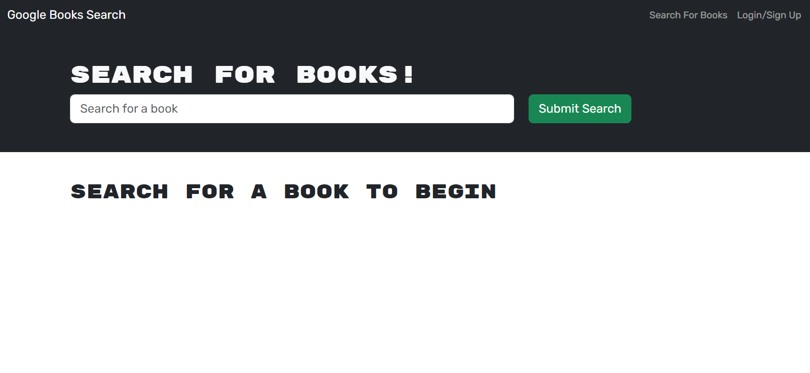

Googlebooks-API
Description

In this repository, you will find the enhanced and refactored files for a Google Books API application. Leveraging the power of MongoDB, Mongoose, Express.js API, React, and Node.js, users can seamlessly explore the vast Google Books collection, discovering titles of interest and effortlessly saving them for future reading. The application, initially utilizing a RESTful API, has been thoughtfully transformed into a cutting-edge Graphql API, skillfully crafted with Apollo Server to deliver a more streamlined and immersive user experience.

Table of Contents
Installation
Usage
License
Contributing
Tests
Questions
Usage
Googlebooks homepage

Googlebooks search result "The Lorax"

License
This project is covered under the MIT License.

https://opensource.org/license/mit/

Contribution

Tests
Test the app by creating profiles and searching for books to add and remove books from their personal reading list.

Questions
Github username: ColeChaffin
Email: cchaf7899@gmail.com